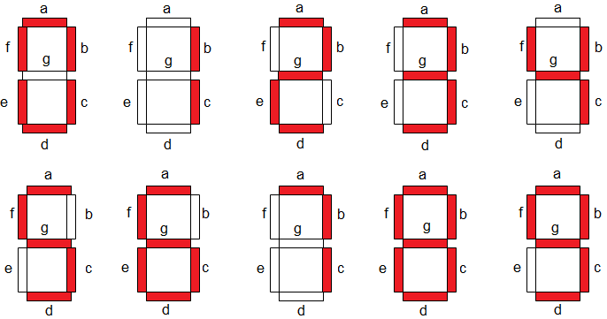

# EXE1

Neste exercício, você deve desenvolver um firmware que:

Possui as seguintes funções:
- `seven_seg_init()`: inicializa os pinos do display de sete segmentos, o display deve começar com o número 0;
- `seven_seg_display(int val)`: Ao receber um valor inteiro de `0..9` exibe o mesmo no display;

Toda vez que o botão for apertado vocês devem aumentar o valor que é exibido no display, começando por 0, ao chegar em 9 o contador deve ser zerado.

## Display de 7seg

Lembrem que o display de sete segmentos funciona da seguinte maneira:

## Detalhes do firmware:

- Baremetal (sem RTOS).
- Deve passar nos testes `embedded_check`, `cpp_check` e `rubric_check`.
- Deve trabalhar com interrupções nos botões.  
- Não é permitido usar `gpio_get()`.
- Deve implementar e usar as funções `seven_seg_int()`, `seven_seg_display(int val)`

## Testes

O código deve passar em todos os testes para ser aceito:

- `embedded_check`
- `firmware_check`
- `wokwi`

Caso acredite que o seu código está funcionando, só que os testes falham, preencha o forms:

[Google forms para revisão manual](https://docs.google.com/forms/d/e/1FAIpQLSdikhET4iqFwkOKmgD-G6Ri-2kCdhDLndlFWXdfdcuDfPnYHw/viewform?usp=dialog)
